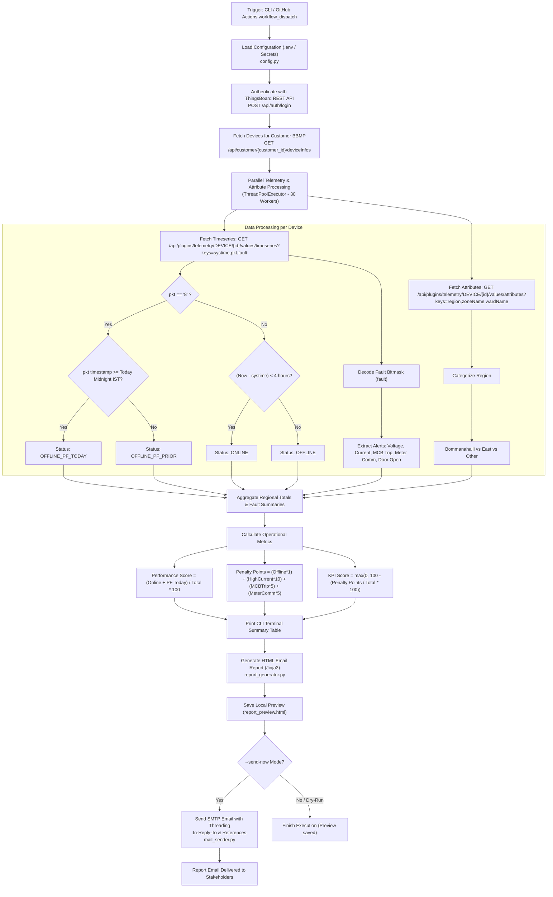

# BBMP Panel Telemetry & Monitoring System - Workflow & Architecture

## Project Overview

The **BBMP Panel Telemetry & Monitoring System** is an automated Python application designed for **Bruhat Bengaluru Mahanagara Palike (BBMP)**. It monitors thousands of smart street light control panels across Bengaluru (specifically targeting regions like Bommanahalli and East zones) by interacting with the **ThingsBoard IoT REST API**.

The application fetches real-time telemetry, determines panel status (Online, Offline, Power Failure), decodes hardware fault bitmasks, computes key operational scores (Panel Performance Score & KPI Score), generates a formatted HTML email report, and delivers it to stakeholders with email threading enabled.

---

## End-to-End System Workflow

---

## Step-by-Step Breakdown of Data Fetching & Processing

### 1. Configuration & Credential Validation
* **Module**: [config.py](file:///d:/Schnell/BBMP_Panel_Report/config.py)
* Loads environment variables from `.env` or system environment (for GitHub Actions).
* Validates critical parameters: `THINGSBOARD_HOST`, `THINGSBOARD_USERNAME`, `THINGSBOARD_PASSWORD`, and SMTP server credentials.

### 2. Authentication with ThingsBoard API
* **Module**: [tb_client.py](file:///d:/Schnell/BBMP_Panel_Report/tb_client.py#L24-L48)
* **Endpoint**: `POST {TB_HOST}/api/auth/login`
* **Payload**: `{"username": "...", "password": "..."}`
* **Response**: Retrieves JWT Bearer Token (`token`) and updates session headers with `X-Authorization: Bearer <token>`.

### 3. Device Discovery & Customer Filtering
* **Module**: [tb_client.py](file:///d:/Schnell/BBMP_Panel_Report/tb_client.py#L205-L243)
* **Customer ID**: `e2119df0-45c3-11f0-94dc-77130b2f47e9` (BBMP Bangalore Customer).
* **Endpoint**: `GET /api/customer/{customer_id}/deviceInfos?pageSize=1000&page={page}`
* Loops through paginated pages until `hasNext` is false, retrieving metadata for all street light panels.

### 4. High-Performance Telemetry Retrieval & Bitmask Decoding
* **Module**: [tb_client.py](file:///d:/Schnell/BBMP_Panel_Report/tb_client.py#L307-L440)
* Executes **30 parallel worker threads** using `ThreadPoolExecutor` for high throughput.
* **Timeseries Fetch**: `GET /api/plugins/telemetry/DEVICE/{dev_id}/values/timeseries?keys=systime,pkt,fault`
  * **`pkt` (Packet Type)**: If `pkt == "8"`, the panel is experiencing a **Power Failure (PF)**.
    * If `pkt_timestamp >= Today Midnight (00:00 IST)`, classified as `OFFLINE_PF_TODAY`.
    * Otherwise, classified as `OFFLINE_PF_PRIOR`.
  * **`systime` (System Time)**: Heartbeat timestamp (in seconds).
    * If `(Current Time - systime) < 14,400 seconds (4 Hours)`: Panel is **ONLINE**.
    * Otherwise: Panel is **OFFLINE** (Communication/System failure).
  * **`fault` (Bitmask Integer Decoding)**: Decodes integer bit positions into specific hardware alarms:
    * `RVL`, `YVL`, `BVL` $\rightarrow$ Low Voltage
    * `RVH`, `YVH`, `BVH` $\rightarrow$ High Voltage
    * `RCH`, `YCH`, `BCH` $\rightarrow$ High Current / Power Theft
    * `RCL`, `YCL`, `BCL` $\rightarrow$ Low Current
    * `MCB` $\rightarrow$ MCB Trip
    * `RCF`, `YCF`, `BCF` $\rightarrow$ Relay Failure
    * `MTR` $\rightarrow$ Meter Communication Failure
    * `BPS` $\rightarrow$ Manual Operation / Bypass
    * `TPR` $\rightarrow$ Panel Door Open / Tamper
* **Attributes Fetch**: `GET /api/plugins/telemetry/DEVICE/{dev_id}/values/attributes?keys=region,zoneName,wardName`
  * Categorizes panels into **Bommanahalli**, **East**, or **Other** zones based on metadata strings.

---

## Formulas & Operational Scoring

### 1. Panel Performance Score (%)
Measures operational availability, counting online panels and grid power outages occurring today:

$$\text{Performance Score} = \left( \frac{\text{Online Panels} + \text{Offline PF Today}}{\text{Total Panels}} \right) \times 100$$

### 2. Penalty Points Calculation
Assesses technical issues excluding external power grid failures:

$$\text{Penalty Points} = (\text{Offline Excl. PF} \times 1) + (\text{High Current} \times 10) + (\text{MCB Trip} \times 5) + (\text{Meter Comm Failure} \times 5)$$

### 3. KPI Score (%)
Overall quality metric based on penalty deductions:

$$\text{KPI Score} = \max\left(0, 100 - \frac{\text{Penalty Points}}{\text{Total Panels}} \times 100\right)$$

---

## HTML Generation & Email Threading

1. **Terminal Output**: [main.py](file:///d:/Schnell/BBMP_Panel_Report/main.py#L116-L147) formats an ASCII table directly in terminal output.
2. **HTML Report**: [report_generator.py](file:///d:/Schnell/BBMP_Panel_Report/report_generator.py) uses Jinja2 templating to construct a responsive, styled report with KPI cards, regional availability breakdown, and active issues summary.
3. **Email Dispatch**: [mail_sender.py](file:///d:/Schnell/BBMP_Panel_Report/mail_sender.py) sends the report over SMTP. It manages thread state (`.email_thread_state.json`) and injects standard RFC 5322 headers (`Message-ID`, `In-Reply-To`, `References`, `Thread-Topic`) to group daily status updates cleanly into a single email thread in Gmail and Outlook.

---

## CI/CD Automation

* **Workflow File**: [.github/workflows/daily_report.yml](file:///d:/Schnell/BBMP_Panel_Report/.github/workflows/daily_report.yml)
* Can be triggered manually via `workflow_dispatch` or on schedule via `repository_dispatch`.
* Pulls secure credentials from GitHub Secrets and runs `python main.py --send-now`.
